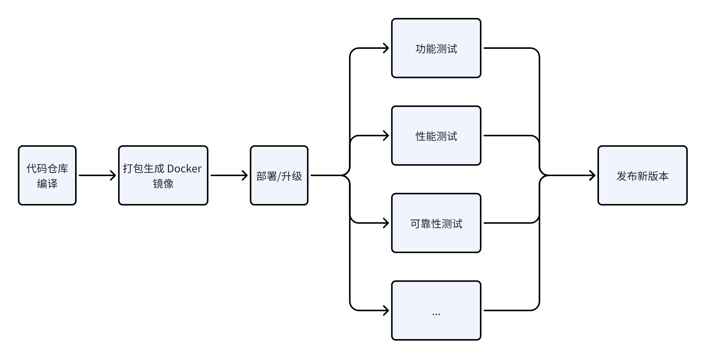

现代研发的流水线，不只是 CI/CD 的产物，更是“工程自律”的化身。

它像是你团队的“数字禅师”：

- 每一次代码提交，它都平静地问你一句——**“确定这能上线？”**
- 每一次部署前，它都轻轻提醒——**“你测过吗？”**
- 每一次系统波动，它又会用拨测的方式嘀咕——**“你又挂了喔～🤨”**

我们前面介绍了单元测试在稳定性建设中的重要作用，但除了单元测试之外，通常我们还需要其它形式的测试。

而这些测试，不再是靠人手点点点完成的，而是通过各种自动化的**测试流水线（Test Pipeline）**实现的。

测试流水线是一种软件开发过程中的自动化流程，它将软件测试的各个环节有序地组织起来，实现测试任务的自动化执行和管理，从而持续保障软件质量与稳定性。

在分布式系统中，我们常常会配置不同用途的流水线，比如：

| 流水线 | 主要目的 |
| --- | --- |
| 研发流水线 | 快速确保新代码没有影响原有系统的基础功能。通常在几小时内可以完成测试。 |
| 准入流水线 | 确保新版本未破坏系统基础功能。测试范围比研发流水线大，覆盖的场景更多。 |
| 系统集成流水线 | 结合其它依赖系统，进行整体的测试，测试范围最广。一般是发布前的最后一轮测试。 |
| 拨测流水线 | 软件上线后，在生产环境中基于真实流量的测试。可快速发现线上问题，提前于客户察觉。 |

今天，我们就来聊聊其中最常见也最关键的“三部曲”：

**研发自测 → 准入测试 → 拨测**。

它们构成了分布式系统稳定性的**第二道自动防线**。

# 不同的流水线

## 研发流水线：让 Bug 死在开发机上

研发流水线是第一道防线，通常由研发的行为触发（例如向代码仓提交一个 Merge Request）。

它的目标很朴实——**不要让低级错误混入主干**。

研发流水线通常包含以下步骤：

- *持续集成支持：**与 Git 集成，在提交 merge request 时自动触发构建。通过构建工具（如 Go、Gradle、Maven）快速验证代码能否正常编译、UT、打包。
    
    ```bash
    go build ./cmd/service
    go test ./... -v
    ```
    
    如果中间过程失败，流水线会立刻打回，开发者会收到友好的提示：
    
    > “你的代码连编译都过不了，还想上线？😏”
    > 
- **代码质量保障：**
    
    使用静态分析工具（如 SonarQube、golangci-lint）扫描潜在缺陷，包括安全风险、资源泄露、空指针等。
    
    ```bash
    golangci-lint run ./...
    ```
    
    这一步往往能挡掉 30% 的潜在问题。
    
- **安全与合规检查：**
    
    使用安全扫描工具（如 Trivy、ZAP）检查依赖库漏洞、加密规范、认证逻辑等。让研发流水线不仅关注“能跑”，更关注“能安全地跑”。
    
- **快速反馈机制：**
    
    每次构建都会生成清晰的测试报告。这样开发者能在几分钟内定位错误。
    

在实际团队中，研发流水线常常作为 Merge Request 的准入门槛之一：

> “只有当你的代码通过编译 + 测试 + 安全检查，这个 MR 才能被 Approve。”
> 

## 准入流水线：让版本带着尊严进主干

准入流水线（Gate Pipeline）是团队的“守门员” 🧱

如果说研发流水线关心的是——**“这代码能不能跑？”**

那么准入流水线要问的就是——**“上线之后，会不会炸？”**

它通常运行在预发或测试环境，用来验证一个版本是否“站得稳、扛得住、跑得快”。

换句话说，它是版本上线前的最后一关，是系统稳定性的守门员。

### 🧩 功能完整性与稳定性初筛

准入流水线的测试范围更广，不仅仅盯着单个模块，而是看整个系统的“协奏曲”。

比如：用户登录 → 下单 → 支付 → 通知，这一整套跨服务链路都要验证。

有任何一个环节掉链子，就意味着系统的整体体验可能被拖垮。

### 🏗️ 环境一致性验证

代码没问题，但环境出幺蛾子，一样要挂。

所以准入流水线会严格比对目标环境与生产环境的依赖一致性：

操作系统、数据库版本、中间件参数、运行时配置……统统要对齐。

举个例子：

如果 MySQL 版本不一致、Redis 参数没同步、或者 Java 运行时版本跑偏，

那都可能导致上线后一堆玄学问题。

### ⚡ 性能与基线检查

这一环更像是短跑比赛前的热身。

流水线会用一些常见工具（`vegeta`, `k6`, `locust`）做短时压力测试，

对关键接口的性能进行回归校验。

一旦发现延迟比上个版本高出 20%，

流水线会毫不留情地挡住你：

> “性能退步？请回去补课🎯。”
> 



上图展示了一个简化版的准入测试流水线。

每个阶段背后都有自定义的脚本和验证逻辑：

- **编译阶段：** 拉取代码和依赖，完成编译。
- **打包阶段：** 使用 Dockerfile 生成镜像。
- **部署阶段：** 将镜像部署或升级至测试环境。
- **测试阶段（并发执行）：**
    - **功能测试：** 确保核心功能可用，新修改不会 break 旧逻辑。
    - **性能测试：** 检查系统性能是否保持稳定，无明显退化。
    - **可靠性测试：** 模拟故障场景，验证 failover 与 RTO/RPO 是否达标。

在大型分布式系统中，准入流水线也是“信任协议”的一部分：

谁的代码能过它，谁的版本就能被部署。

> 💡**实践建议：**
> 
> 
> 测试用例可以由研发或测试工程师共同编写。
> 
> 常用语言是 **Python** 或 **Golang**，两者都便于集成 CI/CD 系统，同时支持快速编写高并发测试、接口验证和日志采集逻辑。
> 

## 拨测流水线：让系统有“生命体征”

如果说准入流水线是“门卫”，那么拨测流水线（Probe Pipeline）就是系统的“体检医生”。

它在生产环境中持续监测服务是否健康。拨测流水线的目标是——**比用户更早发现问题**。

### 拨测的常见形式：

| 拨测类型 | 内容 | 频率 |
| --- | --- | --- |
| 健康拨测（Health Probe） | 检查 HTTP 200、数据库连通性 | 每 30 秒 |
| 功能拨测（Feature Probe） | 模拟用户真实操作 | 每 1 分钟 |
| 边界拨测（Edge Probe） | 验证跨地域、跨 AZ 稳定性 | 每小时 |
| 混沌拨测（Chaos Probe） | 模拟部分组件故障 | 每天/演练期 |

这些拨测任务通常运行在定时任务或 CI/CD 平台中（如 Jenkins、GitHub Actions、Argo Workflows），

一旦出现异常，就会触发报警机制。

拨测让系统有了“心跳”和“自愈意识”，

你甚至可以理解为：

> “这是系统在向你报告——我今天状态不错 😎。”
> 

## 流水线的合奏：从提交到稳定

当自测、准入、拨测三者融合到一条自动化链路中，就形成了一个稳定性的闭环：

```
开发提交 → 研发流水线自测 → 准入测试 → 部署 → 拨测验证 → 告警/反馈

```

这时，系统稳定性验证从“人盯人”变成了“机器协作”：

每一次提交、每一次部署、每一次报警，

都在被流水线自动感知与验证。

这就是现代稳定性文化的核心——**把测试融入系统生命循环（System Lifecycle）**。

# 小结：流水线是信任机器

流水线化测试不是形式主义，而是一种“团队信任机制”。

- 研发流水线代表：**开发者自律**
- 准入流水线代表：**版本可信**
- 拨测流水线代表：**系统可靠**

它们共同构成了工程稳定性的自我防御系统。

从单元测试的局部保障，到流水线的整体防线，

稳定性已经不再是一个“阶段性任务”，而是一个**持续被验证的状态**。

所以，下次当你看到 Jenkins 上那条绿线时，请微微一笑🙂——

那不仅代表构建通过，更代表你的系统在说：

> “我准备好稳定地活下去了。” 🚀