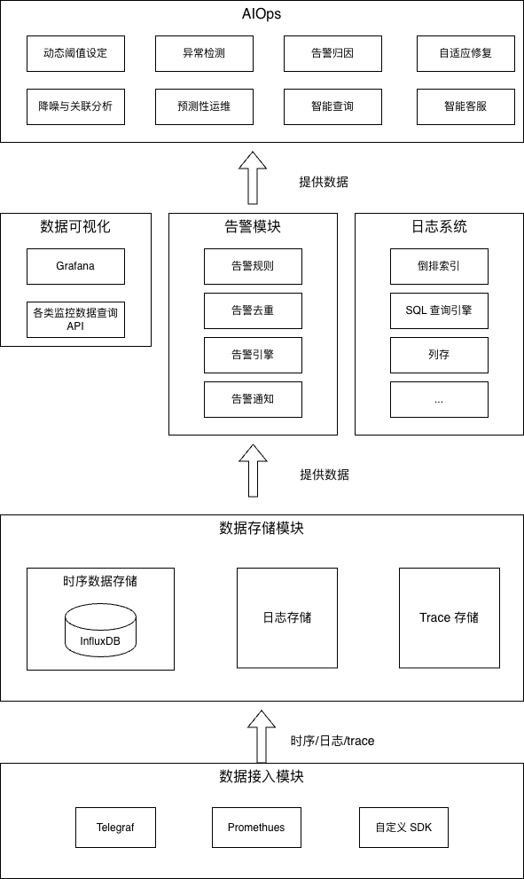

# 可观测性的三大支柱：指标、日志、追踪

这三个工具就像系统的“三件套听诊设备”，配合得好，能让你精准地“诊断”出架构中的潜在问题。

## 一、指标（Metrics）：告诉你“问题是否发生”

指标是一切异常的“第一信号”。

它用数字讲述事实——CPU、内存、磁盘、延迟、QPS、错误率。

当你看到指标突然跳变时，不一定知道原因，但至少能确定：**“出事了。”**

举个例子，一个在线支付系统平时延迟在 200ms 左右，忽然飙升到 3 秒。

监控系统第一时间报警，你打开仪表盘一看，数据库查询量也在暴涨。没多久就能定位到：索引失效，全表扫描。

如果没有这些指标，你可能要在黑夜里猜半天。

常见方案包括：

- **Prometheus** 或 **VictoriaMetrics** 收集指标；
- **Grafana** 展示趋势；
- **Alertmanager** 触发告警。

一句话总结：**好指标能让你未卜先知，坏指标只会让你凌晨 Debug。**

## 二、日志（Logs）：告诉你“问题是什么”

日志是系统的**自白书**。

它会老老实实地记录下每一次请求、每一次错误、每一次奇怪的重试。

如果指标是告诉你“体温升高”，日志就是那位医生问你：“昨晚吃了啥？是不是通宵了？”

日志系统的难点在于量。

现代系统一天能产出上百 GB 的日志，就像有人在你耳边不停碎碎念。

要想听出重点，就得有一套好规则。

一个理想的日志体系，至少要做到：

- **有层次**：区分访问日志、业务日志、错误日志；
- **有索引**：快速查找“那条关键的信息”；
- **有格式**：统一时间线和结构，方便分析。

现实中，大多数团队会选择 **ELK（Elasticsearch + Logstash + Kibana）**、**Loki** 或 **Splunk**。

这些工具能让你像 FBI 一样，在百万行日志中精准锁定“凶手”。

一个简单的经验法则：

**日志不是越多越好，而是越“有价值”越好。**

（谁都不想在凌晨两点翻十亿行日志找一个空指针 😅）

## 三、追踪（Tracing）：告诉你“问题出在哪里”

分布式系统就像一场接力赛。一个用户请求，可能从前端出发，经过负载均衡、API 网关、微服务、数据库、缓存，最后又绕回来。

中途哪一棒掉了？追踪系统能告诉你。

Tracing 系统通过在每个请求上打上 **Trace ID**，记录下它经过的所有节点和耗时。

你能在可视化界面上看到整条调用链，像看地铁图一样清晰。

举个例子：

某天用户反馈“打开页面特别慢”，指标告诉你平均延迟升高，日志却没报错。

打开 Jaeger 一看——服务 C 的某个接口耗时高得离谱。

一排红色的 Trace Span，像在对你大喊：“我卡这儿了！”

常用方案包括：

- **OpenTelemetry**（业界标准）
- **Jaeger**
- **Zipkin**

一个小建议：**打点不要太吝啬。**

Trace span 多一点没坏处，最怕的就是系统炸了，回头才发现关键路径没打点。

（此时的心情，和发现代码没保存就关机一样崩溃 😂）

## 小结：让系统“说人话”，你才能少掉头发 🧠

可观测性不是“监控的花哨版”，而是让系统具备自我表达、自我诊断的能力。

它帮你看清问题、预警风险，更重要的是——让团队拥有**对复杂系统的信任感**。

当系统能自己告诉你“我哪不舒服”，

你就不再需要每晚抱着控制台熬夜猜谜。

可观测性不是花哨指标的堆砌，而是稳定性体系中最朴素的一句话：

> “我知道问题在哪，我能看见它。” 👀
> 

# 可观测体系架构

一个成熟的可观测性体系，通常包含这些模块：

- **数据接入模块**：采集来自服务、设备、应用的指标和日志（代理、插件、API 都行）。
- **数据存储模块**：用时序数据库或 NoSQL 存储数据，保证查询高效。
- **告警模块**：设定阈值和规则，触发告警，通过邮件、IM、电话等通知。
- **数据可视化模块**：用仪表盘、报表和图表直观呈现状态。
- **日志系统**：支持查询、聚合和上下文分析。
- **AIOps 模块（可选）**：利用机器学习做异常检测、趋势预测，提前“嗅出”问题苗头。

