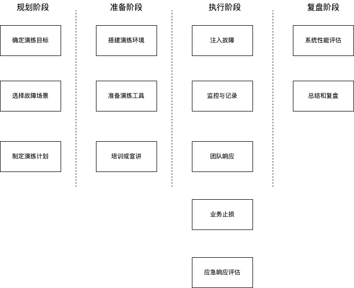
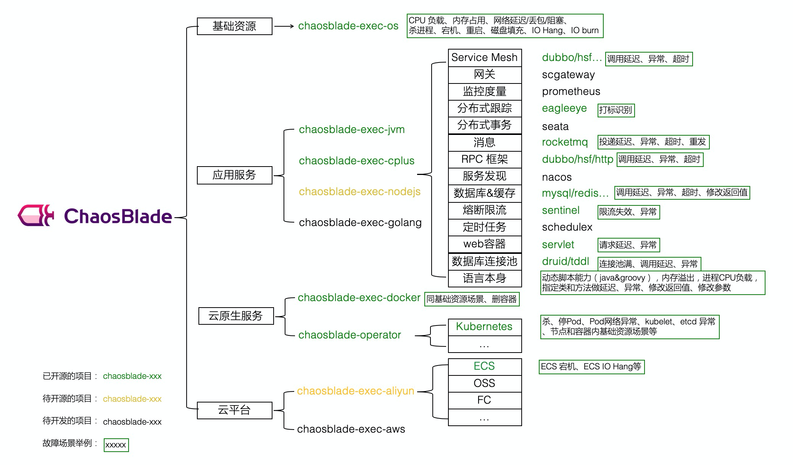

很多团队在设计系统的时候，嘴上说着“高可用、可恢复”，但心里其实都想：

> “希望它永远别出事。”
> 

于是，冗余架构、主备切换、灾备机房，全都写进了PPT。但真当系统挂了，

PPT 只能当纸巾擦眼泪。

所以啊，**混沌测试（Chaos Testing）** 就诞生了—— 一种看似“自残式”的测试方法，核心目标是：

> “在系统最安全的时候，主动制造一点小灾难。”
> 

听起来有点疯狂？没错，但这正是让系统真正“抗造”的秘诀。😎

# 为什么要搞混沌测试？

因为——系统在平时从来不会告诉你它哪里脆弱，

只有你**亲手掀桌**的时候，它才会老实交代。😏

混沌测试的意义，不是为了让谁背锅，而是让系统“提前经历一场虚拟灾难”，从而知道——它在危机时刻，能不能挺住。

说白了，这就像是消防演练：

不是希望哪天真的起火，而是想看看——

- 🔥 **监控能不能第一时间报警？**
- 🚒 **团队能不能迅速集结？**
- 📖 **应急预案是不是早就吃灰了？**

很多团队平时都挺自信：“我们系统很稳啊！”

结果第一次搞混沌测试，往往发现：

- 告警指标不全，定位问题比破案还难；
- 某服务居然写死了 IP，一宕机全线瘫；
- 数据库延迟一高，整个业务就跟卡在原地；
- 打开 SOP 文档，发现最后更新日期是三年前 🙃；
- 一旦真挂了，没人指挥，大家乱成一锅粥。

> 本来预想是“从从容容、游刃有余”，
> 
> 
> 实际上却是“匆匆忙忙、连滚带爬”😂。
> 

混沌测试能帮我们干的事，其实挺实在的：

1. **提前发现系统的脆弱点**
    - 在分布式架构里，任何一个节点挂了都可能牵一发动全身。
        
        混沌测试能帮你验证：系统能否自动切换？冗余是不是够？
        
    - 无论是硬件故障（服务器挂了）、软件故障（进程崩了）、还是网络抖动（延迟炸裂），都能让系统提前“练练兵”。
2. **检验团队的“危机肌肉反应”**
    - 故障发生后，报警能不能第一时间响？
        
        运维和开发能不能立刻接力？
        
        根因分析是否能快准狠？
        
    - 这些演练不是为了找茬，而是为了验证：
        
        我们的灾备方案、切换脚本、应急流程，能不能在**真实的混乱场景中**跑得动。
        
3. **磨合团队协作**
    - 故障现场其实就是一面镜子。
        
        混沌测试能照出沟通的短板、流程的漏洞，以及“谁该出手但还在等通知”的瞬间。
        
    - 让开发、测试、运维不再各自为战，而是形成真正的“应急共同体”。

**一句话总结：**

混沌测试不是“作死”，而是“练不死”。它让系统更坚韧，让团队更默契，让危机时刻变得不再恐慌。

> 真正的稳定，不是没出过问题，而是出了问题还能笑着解决😉。
> 

# 怎么做混沌测试



故障演练不是临时起意的“砸场子”，而是一场精心策划的技术“实战演习”。它的目标，是在**可控的混乱中检验系统的韧性**，让团队能在真正的灾难来临之前，先练过几次。

下面是一个相对完整的流程，可以帮助团队系统化地设计和实施故障演练。

### 1. **规划阶段**

在开始动手之前，先想清楚：为什么要演、演什么、怎么演。

- **确定演练目标**：明确要测试的系统功能、性能指标以及希望提升的应急响应能力。比如，目标可能是验证系统在 **大规模 Kubernetes 节点宕机** 后的自愈能力，或者检验新的**故障转移机制**是否真的能“无缝切换”。
- **选择故障场景**：基于系统架构、历史故障数据和风险评估，选择具有代表性的模拟故障。例如：
    - 硬件类：模拟服务器磁盘损坏；
    - 软件类：模拟 Kubernetes 证书全丢、NAS 超冗余故障；
    - 网络类：制造网络拥塞、链路中断；
    - 安全类：模拟 SQL 注入或权限异常。
        
        这些场景的重点，不是“搞崩系统”，而是“测出边界”。
        
- **制定演练计划**：包括演练的时间、参与人员、沟通渠道、应急步骤和预期结果。
    
    比如：在模拟故障发生后，运维应在 5 分钟内介入排查，开发应在 15 分钟内定位根因，30 分钟内恢复核心业务。
    

### 2. **准备阶段**

就像打仗前要先摆好阵型，准备阶段的目标是“搭好场子”。

- **搭建演练环境**：一般在生产环境的副本中进行（测试或预生产环境），确保配置、数据、负载尽可能接近真实生产场景。
- **准备演练工具**：
    - 故障注入工具（例如 Chaos Mesh、Litmus、Gremlin），用于制造“事故现场”；
    - 监控与日志系统（如 Prometheus、Grafana、ELK），用于实时捕捉系统表现；
    - 通信与协作工具（Slack、飞书、Zoom），让团队在混乱中还能听得到彼此的声音。
- **培训参与人员**：所有演练成员都要熟悉流程、职责和工具。培训不光是教他们怎么用命令行，更是让他们知道：**出问题时该先做什么、找谁、报告到哪儿。**

### 3. **执行阶段**

到了这一步，就是“实战开演”的时刻了。

- **注入故障**：按计划触发故障，比如人为增加网络延迟，关闭某个关键服务，或模拟存储节点故障。目标是逼系统露出它平时隐藏的短板。
- **监控和记录**：全程通过监控系统观察核心指标（CPU、内存、响应时间、错误率等），并详细记录：
    - 故障发生的时间点；
    - 团队的应对动作；
    - 关键决策与沟通内容。
        
        这些日志将是复盘的“黑匣子”。
        
- **团队响应**：各团队按流程执行：
    - 运维负责现场稳定与恢复；
    - 开发协助修复根因或调优策略；
    - 测试验证系统恢复是否正常。
- **业务止损**：SRE 或研发团队通过限流、降级、流量切换等方式，优先恢复关键业务。
- **应急响应评估**：评估团队表现，包括响应时间、定位效率、止损速度。有时候，这一环的收获比“系统指标”更有价值。

### 4. **评估阶段**

打完仗不能就散场，复盘才是这场演练的灵魂。

- **系统性能评估**：分析故障期间与恢复后的性能数据，看系统是否达到预期指标。例如，服务是否能满足 **5-15-30** 目标：5 分钟发现、15 分钟定位、30 分钟恢复。
- **总结与复盘**：回顾整个过程：
    - 告警是否及时触发？
    - 排查路径是否高效？
    - 沟通是否顺畅？
    - 哪个环节最拖时间？
        
        然后将问题具体化，形成改进措施，比如优化系统架构、完善 SOP 流程、强化团队联动与培训。下一次演练或真实事故中，这些改进将直接决定“成败”。
        

故障演练看似是在“人为制造混乱”，但它的真正目的，是让混乱变得**有序、可控、可学**。

对于复杂的软件系统和关键业务而言，它就像一场必要的“免疫接种”——短痛换来长稳。

> 换句话说，演练做得越真，生产就越稳。😉
> 

# 常见的故障点

下文为分布式系统中常见的故障点分类及可控注入方案。

## 硬件层故障

### 电力与散热

**常见故障点**

- 电源掉电或电压波动
- 单电源模块失效（未冗余或冗余未按预期工作）
- 风扇停转、散热不足、机箱或机柜过热
- 机架/机房供电异常（PDU/UPS 问题）

**表现症状**

- 节点突然掉线或重启
- 日志里出现电压异常、温度超阈或 Thermal Throttle（降频）信息
- BMC/IPMI 报告高温或风扇告警

**常见成因**

- PSU（电源）老化或批次质量问题
- UPS 切换或输出不稳、PDU 配置不当
- 风道被堵、机房空调异常或机柜密度过高造成散热不足

**人为注入方法（仅限隔离测试环境、审批后执行）**

> 安全第一：所有注入必须在隔离测试环境进行，有审批、有备份、有回滚脚本。绝对不要在生产环境随意断电或拔插线缆。
> 
1. **模拟掉电（受控）**
    - 通过测试环境的 PDU/UPS 管理界面对单台机器执行短时断电（例如 10–30 秒），或使用自动化脚本控制 PDU 端口。
    - **切勿**物理拔插电源线或在生产机房直接操作。
    - 注意观察：节点下线时间、上层调度（如 VM/Pod 迁移）、以及是否有数据写入未完成导致损坏的日志。
2. **模拟强制重启（仅在可恢复的测试机上）**
    - `reboot -f` 会强制重启并跳过典型的优雅关机流程；`echo 'b' > /proc/sysrq-trigger` 也可触发立即重启；`echo 'c' > /proc/sysrq-trigger` 触发内核崩溃（crash）。
    - **高度危险**：这些命令会跳过文件系统 flush/卸载等步骤，可能导致数据损坏；只在能接受数据丢失并可完整恢复的隔离环境使用，且要有完整备份与恢复流程。
3. **模拟风扇失效 / 降速**
    - 在支持的硬件上通过 BMC/IPMI 或厂商管理工具调低单个风扇转速或禁用某个风扇模块；观察温度曲线和系统是否降频/触发迁移。
    - 有些厂商固件允许“风扇测试”或“风扇模拟故障”选项，优先使用厂商提供的安全方法。
4. **环境高温**
    - 在封闭测试柜或受控环境里短时升高环境温度（例如 +5–10°C），验证热控策略（降频、报警、迁移）。
    - **注意**：不可在人密环境或生产机房做此类实验。

**检测与缓解**

- 实时监控电源冗余状态、BMC 报警、温度与风扇曲线。
- 自动化策略：异常温度或电源故障触发节点隔离（cordon）并迁移负载，启动备用实例。
- 机房级别：冷热通道隔离、风量与空调冗余、PDU/UPS 负载平衡。

**示例**

某次测试把单台服务器的 PSU 从冗余组中移除（通过 PDU 控制模拟模块失效），集群调度正确将虚拟机迁移并在 30 秒内恢复服务，但发现部分应用在迁移后短时间内发生写失败 —— 原因是应用在节点被标记为不可调度后仍维持旧的连接，解决方式是在迁移流程中增加连接强制断开与客户端快速重试策略。

### CPU / 内存 / PCIe / GPU 故障

**常见故障点**

- CPU 过热导致降频或性能异常
- CPU 频率波动或微码问题
- 内存出现 CE（可纠正）/UE（不可纠正）错误
- PCIe 通道不稳（影响 GPU、NIC 等设备）
- 内存压力或内存过载

**表现症状**

- 内核 panic、机器间歇性重启或降频
- 应用延迟或性能急剧下降
- ECC 报警或系统日志里出现内存/PCIe 错误

**常见成因**

- 散热不佳、风扇问题或机箱气流设计不良
- 接触不良（内存条）或硬件老化
- 驱动或固件 Bug，PCIe 链路抖动

**人为注入方法（仅限测试环境）**

1. **CPU 限频**
    - 使用 `cpufreq-set` 或类似工具临时降低 CPU 最大频率，观察调度器和应用在算力降低时的表现。
    - 示例：在一台测试机器上把频率限制为 50% 并跑压力测试，观察请求延迟是否超过 SLO。
2. **热压测试**
    - `stress-ng --cpu N --timeout 300s`（或类似工具）对 CPU 加压，触发散热/降频策略。
    - 监控温度、频率、系统事件。
3. **内存错误注入**
    - 使用厂商提供的内存错误注入工具（例如 Intel 的测试工具）模拟 CE/UE。不要在真实生产内存上随意注入位翻转。
4. **PCIe 错误模拟**
    - 在可控环境通过驱动调试接口或交换机/BIOS 设置模拟链路抖动、link down/up。

**检测与缓解**

- 监控 ECC/内存错误计数、CPU 温度、频率；对发生异常的节点自动下线并替换。
- 保持 BIOS/微码和驱动统一管理与快速分发更新。
- 在设计上采用冗余计算实例与流量自动分流。

**实例**

一次内存 CE 注入演练发现某 Kubernetes 节点守护进程在检测到硬件 CE 后没有触发下线策略，导致应用继续被调度到不健康节点。修复方案是增强硬件异常到集群调度层的上报链路，并在节点 Controller 中加入硬件健康阈值。

### 存储介质（HDD / SSD / RAID）

**常见故障点**

- 块设备 I/O 错误（读写失败）
- RAID 控制器降级或重建期间性能剧降
- SSD SMART 异常或寿命到期（擦写寿命耗尽）
- 磁盘响应缓慢或 I/O 队列阻塞

**表现症状**

- I/O 延迟上升、吞吐下降（IOPS 下滑）
- 应用报 I/O Error、文件系统变为只读
- RAID 重建日志或 SMART 报警

**常见成因**

- 介质本身老化或批次问题
- 同时重建/修复导致的性能退化
- RAID 卡缓存/电池失效或控制器 Bug

**人为注入方法（仅限测试环境）**

1. **模拟 I/O 延迟**（推荐）
    - 在测试节点上对块设备或网络存储使用 `tc`（网络层）或通过 `blkio`/cgroups 限制 I/O 带宽与延迟；也可使用 `fio` 在目标盘上跑受控慢写/读测试。
    - 示例 `fio` 命令（仅示例，按实际需要调整）：
        
        ```bash
        fio --name=mytest --ioengine=rndwrite --size=1G --numjobs=4 --runtime=30m --time_based --rate=5m
        ```
        
        该命令模拟较低写入速率（5MB/s）和持续负载，用来复现慢盘场景。
        
2. **间歇性读写错误**
    - 使用 `dmsetup create` 配合 `dm-flakey` 创造间歇性错误设备，模拟设备偶发性失效。
3. **磁盘空间耗尽**
    - 在测试文件系统上写入大量测试数据触发“分区满”。
4. **模拟拔盘/删除设备（风险高）**
    - 通过 sysfs 做设备下线（例如 `echo 1 > /sys/block/sdc/device/delete`）并随后扫描恢复，**只能在能接受断盘并完全可回滚的测试环境中**。恢复示例：`echo "- - -" | sudo tee /sys/class/scsi_host/host*/scan` 与 `echo 1 > /sys/bus/pci/rescan`。

**检测与缓解**

- 监控 I/O 延迟（p50/p95/p99）、队列长度、SMART 指标；硬盘异常应自动告警并触发替换流程。
- 使用副本机制（读多副本、热迁移）、分层存储与限流，避免单盘性能退化造成级联故障。
- 在恢复路径上设计快速重建与速率限制，防止重建过程本身把系统拖垮。

**实例**

使用 `dm-flakey` 注入慢盘与短时错误后，发现自研备份系统在并发错误场景下触发大量同步重试，造成写入队列拥堵。修复方案是把重试改为指数退避并把重试次数上限化。

### 链路与交换设备

**常见故障点**

- 网卡端口或光模块故障
- 链路抖动、延迟波动或丢包
- VLAN / 路由配置漂移
- TOR/Leaf/Spine 交换设备异常

**表现症状**

- 丢包率上升、TCP 重传加剧
- 节点偶发断连或服务发现失败
- RPC/数据库调用超时，分布式一致性操作失败

**人为注入方法（仅限测试环境）**

1. **网络延迟 / 抖动 / 丢包**（常用）
    - 使用 `tc` 的 `netem` 模块注入延迟、丢包、重复包等：
        
        ```bash
        tc qdisc add dev eth0 root netem delay 300ms
        tc qdisc add dev eth0 root netem loss 7%
        tc qdisc add dev eth0 root netem duplicate 1%
        # 删除注入
        tc qdisc del dev eth0 root netem
        
        ```
        
    - 生成网络 IO 压力可用 `iperf`、`netperf` 等工具。
2. **链路中断（慎用）**
    - 在测试节点上下线单个接口（`ip link set eth0 down` 或 `ifconfig eth0 down`），或在交换机上断开端口（在测试交换机进行）。**不要在生产环境直接执行此类命令。**
    - 也可用 iptables 暂时丢弃入/出包：`iptables -A INPUT -j DROP`（注：务必记录并能恢复规则）。
3. **DNS 故障模拟**
    - 在受控测试环境修改 `/etc/resolv.conf` 指向不可用 DNS，或用中间层代理使 DNS 请求超时/错误。

**检测与缓解**

- 网络可达性探针、链路延迟/丢包监控、链路冗余与多路径设计（双网卡或多链路）。
- 对 DNS 加本地缓存、短时故障做降级与重试抖动（jitter）处理。
- 服务间调用加超时、重试与断路器策略，避免重试风暴。

**实例**

一次注入 5% 丢包的演练触发了上游服务的不当重试策略：客户端在短时丢包下疯狂重试，导致后端吞不下请求并陷入循环。后续通过在客户端加入指数退避并设置最大并发重试数解决该问题。

## 系统层故障（内核 / 驱动 / 文件句柄）

**常见故障点**

- 内核崩溃（panic）或内核模块异常
- 驱动加载失败或 ABI 不兼容
- 文件句柄（FD）耗尽或泄漏

**人为注入方法（仅限测试环境）**

- 使用 `sysrq-trigger` 在隔离虚拟机上触发内核相关事件（例如模拟挂起）。这些操作风险很高，可能导致不可恢复的数据损坏。
- 通过 `ulimit -n 10` 限制可用文件描述符，然后运行高并发测试来模拟句柄耗尽场景。
- 在 driver/test 工具允许的情况下模拟设备驱动异常（仅在开发/测试驱动环境）。

**检测与缓解**

- 自动重启配置（在能接受的场景下）与 coredump 收集以便事后分析。
- FD/句柄监控（`lsof`、`/proc/<pid>/fd`），设置 FD 使用阈值告警并自动回收连接。
- 节点健康探针与自动替换机制。

## 进程故障（控制信号）

**常见操作（测试/演练）**

- 强制终止进程：`kill -9 $pid`（强制，无法优雅退出）
- 暂停进程执行：`kill -19 $pid`（SIGSTOP）
- 恢复暂停进程：`kill -18 $pid`（SIGCONT）

**注意**：这些命令会直接影响进程状态，可能导致请求丢失或资源未释放。只在测试环境或明确可接受后果的场景下使用。

## 配置错误

**常见故障点**

- 配置参数被错误修改导致服务无法启动或行为异常
- 环境变量缺失或变更
- TLS/证书过期或不匹配

**人为注入方法（测试环境）**

- 替换配置文件为错误版本，或在配置管理系统中回滚到旧版配置以验证回滚流程。
- 注入过期或错误的证书到测试服务，观察认证失败与降级路径。
- 删除关键环境变量并重启服务（仅在可恢复环境）。

**检测与缓解**

- 启动前做配置校验（lint/validate）并在 CI/CD 中执行；配置变更必须走审批流程并支持灰度发布。
- 证书到期告警、自动续签与多证书策略（备用证书）。
- 快速回滚路径与配置版本化。

## 依赖与下游故障

在外部依赖出现暂时或长期的不可用时，被测试的业务（上游业务）是否能做到故障自愈，是否具备极端情况下的逃生手段。

**常见故障点**

- 外部 API 超时、错误或不可用（第三方服务降级）
- 数据库连接池耗尽或出现慢查询
- 消息队列堆积、消费者不可用

**人为注入方法（推荐使用代理工具）**

- 使用 Toxiproxy、Mountebank 等代理在调用链路中注入超时、限速或错误，模拟第三方不稳定。
- 暂停某个数据库节点或把它隔离到黑洞网络中以模拟 DB 不可达（仅测试环境）。
- 向队列写入大量消息制造堆积，观察消费者扩容与降级策略。

**检测与缓解**

- 熔断、限流、降级与异步队列化处理；在客户端做超时与退路（fallback）策略。
- 数据库连接池设置合理上限与超时回收，监控连接占用率。
- 消息队列监控（队列长度、消费者延迟），支持动态扩缩容和优先级队列。

## 安全与权限类故障

**常见故障点**

- 证书或 Token 过期/失效
- 权限配置漂移（ACL/Role 错置）
- 服务间认证链断裂

**人为注入方法**

- 在测试环境替换凭据为无效版本，或临时停用认证/授权服务，观察上游服务的降级行为。
- 在 API Gateway 层返回 403/401 来模拟权限异常路径。

**检测与缓解**

- 自动续签与轮换凭据机制（证书、Token），凭据到期告警。
- 统一身份认证服务的健康探针、跨区域凭据同步与回滚。
- 访问控制变更走审计与审批流程。

## 其它故障注入工具

**ChaosBlade** 是阿里巴巴开源的一款简单易用、功能强大的混沌实验注入工具，旨在帮助开发和运维人员通过故障注入测试系统的稳定性，确保系统能够在遭遇各种故障时自动恢复。它支持多种故障类型，包括 CPU、内存、磁盘、网络等。



1. 制造内存占用

./blade create mem load --mem-percent 95 --mode ram

1. 制造CPU 占用

./blade create cpu load --cpu-percent 85

1. 恢复故障

./blade destroy  xxxx

## 小结（要点回顾）🧾

- 所有**硬件层面的注入都必须在隔离、可回滚的测试环境中进行**；电源、磁盘、散热类操作尤其危险。
- 注入前写清楚演练目标、范围、观测指标、恢复步骤与审批人；每一步都要有人负责并能快速回滚。
- 观察比破坏更重要：注入的目的不是把系统摧毁，而是验证**监控、报警、自动化恢复**是否生效。
- 发现问题后把“学习到的操作”代码化（playbook、自动化 runbook），不要只口头记录。